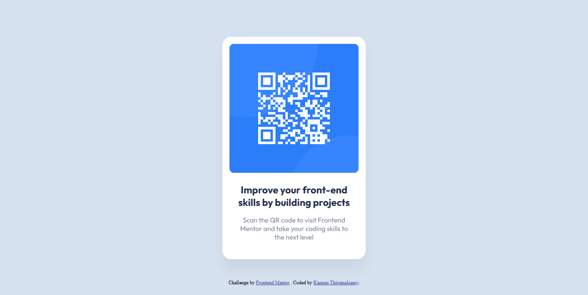

# Frontend Mentor - QR code component solution

This is a solution to the [QR code component challenge on Frontend Mentor](https://www.frontendmentor.io/challenges/qr-code-component-iux_sIO_H).

## Overview

### Screenshot

### Links

- Solution URL: [github](https://github.com/kannanthirumal/frontendmentor-qr-code-component-challenge)
- Live Site URL: [live site URL](https://kannanthirumal.github.io/frontendmentor-qr-code-component-challenge/)

### Built with

- HTML
- CSS
- JavaScript
- React

## Author

- Frontend Mentor - [@kannanthirumal](https://www.frontendmentor.io/profile/kannanthirumal)
